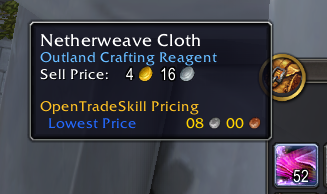

# OpenTradeSkill_Pricing

**WIP**: this is an incomplete setup.

An open source auction house pricing addon for World of Warcraft.



## Installation
You will first need to install and configure a price source: https://github.com/opentradeskill/price-db

Then you can freely download the latest version and use it.

## Use the Pricing API
First, set your addon to depend / optionally depend on `OpenTradeSkill_Pricing`:
```
## Dependencies: OpenTradeSkill_Pricing
```
or..
```
## OptionalDeps: OpenTradeSkill_Pricing
```

You can now consume the `OpenTradeSkill.Pricing` API:
```lua
-- Lookup accepts an item ID, item link, or item string.
-- If a price is available, it will return it, otherwise returns -1
-- An alias for OpenTradeSkill.Pricing:LookupWithContext(item_thing, { region_id: GetCurrentRegion(), realm_id: GetRealmID() })
local price = OpenTradeSkill.Pricing:Lookup(21877)
if price == -1 then return end
print("Price: " .. price)

-- LookupWithContext allows you to specify a region and realm
local price = OpenTradeSkill.Pricing:LookupWithContext(21877, { region_id = GetCurrentRegion(), realm_id = GetRealmID() })
if price == -1 then return end
print("Price: " .. price)
```

If `OpenTradeSkill_Pricing` is an `OptionalDeps`, then you may want to check if it exists first:
```lua
function DoLookup(item_thing)
    if OpenTradeSkill and OpenTradeSkill.Pricing then
        return OpenTradeSkill.Pricing:Lookup(item_thing)
    end
    return -1
end

local price = DoLookup(21877)
if price == -1 then return end
print("Price: " .. price)
```